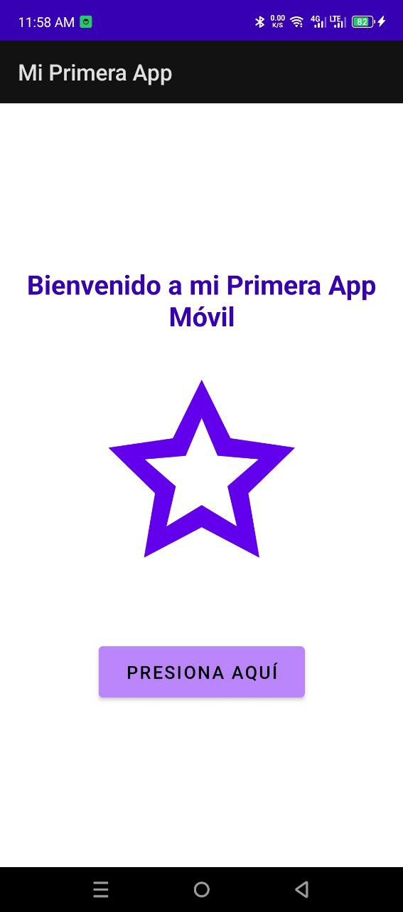
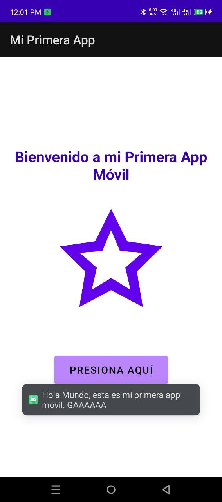

# 📱 Mi Primera App Móvil - Android

Una aplicación móvil básica desarrollada en Android Studio que demuestra las características esenciales de una app Android moderna.

## Enlace al Repositorio (GitHub)
[Repositorio de la App Acá 🐈‍⬛](https://github.com/davidmanueldev/app-movil-basica-kotlin-unifranz)

## Descripción

Esta aplicación Android incluye los componentes fundamentales de una interfaz móvil:
- **TextView**: Mensaje de bienvenida
- **ImageView**: Imagen decorativa (estrella vectorial)
- **Button**: Botón interactivo
- **Toast**: Mensaje emergente al presionar el botón

## Características

- Interfaz de usuario intuitiva y centrada
- Diseño responsive con LinearLayout
- Uso de recursos strings para internacionalización
- Imagen vectorial escalable
- Interacción del usuario con feedback Toast
- Colores de Material Design

## Tecnologías Utilizadas

- **Lenguaje**: Kotlin
- **IDE**: Android Studio
- **Min SDK**: 24 (Android 7.0)
- **Target SDK**: 36
- **Build System**: Gradle con Kotlin DSL
- **UI**: LinearLayout con componentes nativos de Android
- **Mi setup**: Android Studio en CachyOS (Rolling Release) Linux 

## Estructura del Proyecto

```
app/
├── src/main/
│   ├── java/com/example/tarea1/
│   │   └── MainActivity.kt           # Actividad principal
│   ├── res/
│   │   ├── layout/
│   │   │   └── activity_main.xml     # Diseño de la interfaz
│   │   ├── values/
│   │   │   ├── strings.xml           # Recursos de texto
│   │   │   └── colors.xml            # Paleta de colores
│   │   └── drawable/
│   │       └── imagen_ejemplo.xml    # Imagen vectorial
│   └── AndroidManifest.xml           # Configuración de la app
├── build.gradle.kts                  # Configuración de dependencias
└── gradle/
    └── libs.versions.toml            # Versiones centralizadas
```

##  Instalación y Configuración

### Prerrequisitos
- Android Studio Arctic Fox o superior
- JDK 11 o superior
- Dispositivo Android con API 24+ o emulador

### Pasos de instalación

1. **Clonar el repositorio**
   ```bash
   git clone [URL_DEL_REPOSITORIO]
   cd tarea1
   ```

2. **Abrir en Android Studio**
   - Abre Android Studio
   - Selecciona "Open an existing project"
   - Navega hasta la carpeta del proyecto

3. **Sincronizar dependencias**
   - Haz clic en "Sync Now" cuando aparezca la notificación
   - Espera a que se descarguen todas las dependencias

4. **Ejecutar la aplicación**
   - Conecta tu dispositivo Android o inicia un emulador
   - Haz clic en el botón "Run" (▶️) o presiona `Shift + F10`

##  Uso de la Aplicación

1. **Inicio**: Al abrir la app, verás el mensaje de bienvenida
2. **Imagen**: Se muestra una estrella decorativa en el centro
3. **Interacción**: Presiona el botón "Presiona Aquí"
4. **Feedback**: Aparecerá un mensaje Toast: "Hola Mundo, esta es mi primera app móvil GAAAAA"

##  Capturas de Pantalla

### Interfaz Principal


### Código Kotlin
```kotlin
package com.example.tarea1

import android.os.Bundle
import android.widget.Button
import android.widget.Toast
import androidx.appcompat.app.AppCompatActivity

class MainActivity : AppCompatActivity() {

    override fun onCreate(savedInstanceState: Bundle?) {
        super.onCreate(savedInstanceState)
        setContentView(R.layout.activity_main)

        // Obtener referencia al botón
        val buttonMostrarMensaje: Button = findViewById(R.id.buttonMostrarMensaje)

        // Configurar el listener del botón
        buttonMostrarMensaje.setOnClickListener {
            // Mostrar mensaje Toast al presionar el botón
            Toast.makeText(
                this,
                "Hola Mundo, esta es mi primera app móvil. GAAAAAA",
                Toast.LENGTH_SHORT
            ).show()
        }
    }
}
```

### Toast en Acción
